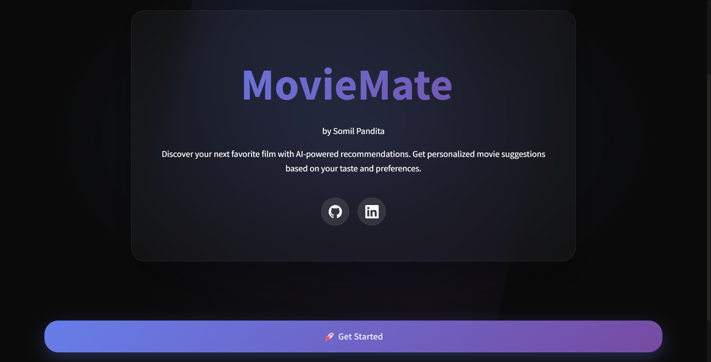
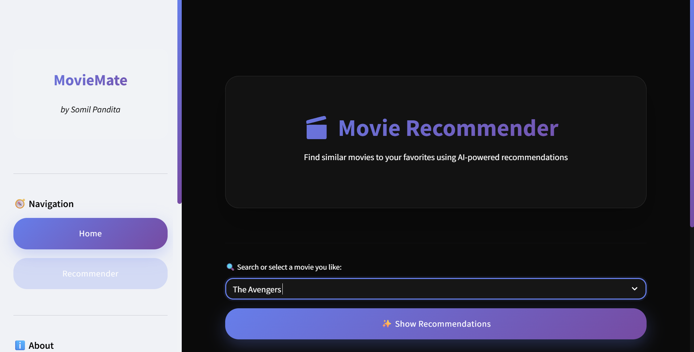
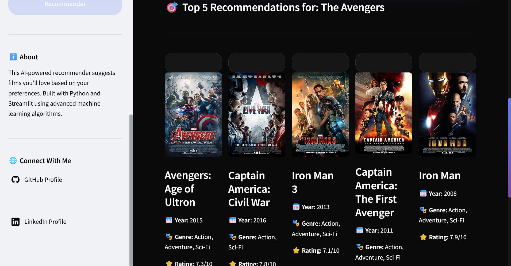

# Movie-Recommendation-system
```markdown
# 🎬 TMDB Movie Explorer

This project uses TMDB movie metadata to provide insights and visualizations through a Streamlit web app.

## 📦 Setup Instructions

1. **Clone the repository**
   ```bash
   git clone https://github.com/your-username/your-repo-name.git
   cd your-repo-name
   ```

2. **Install required packages**
   ```bash
   pip install -r requirements.txt
   ```

3. **Run preprocessing notebook**
   Open and run all cells in `Untitled.ipynb` to preprocess the data.

4. **Launch the Streamlit app**
   ```bash
   streamlit run app.py
   ```

## 📂 Datasets

Downloaded from [Kaggle - TMDB Movie Metadata](https://www.kaggle.com/datasets/tmdb/tmdb-movie-metadata):

- [`tmdb_5000_movies.xlsx`](./tmdb_5000_movies.xlsx)
- [`tmdb_5000_credits.xlsx`](./tmdb_5000_credits.xlsx)

> These contain metadata on over 5,000 movies including cast, crew, genres, and more.

## 💡 Features

- Explore movies and cast/crew data
- Visualize trends from TMDB data
- Simple, interactive UI with Streamlit

---

```markdown
## 📸 Results

Here are some screenshots of the Streamlit web app in action:

  
*Main homepage with movie selection*

  
*Visualization of popular genres over time*

  
*Detailed information about cast and crew*


Made with ❤️ using Python and Streamlit.
```
